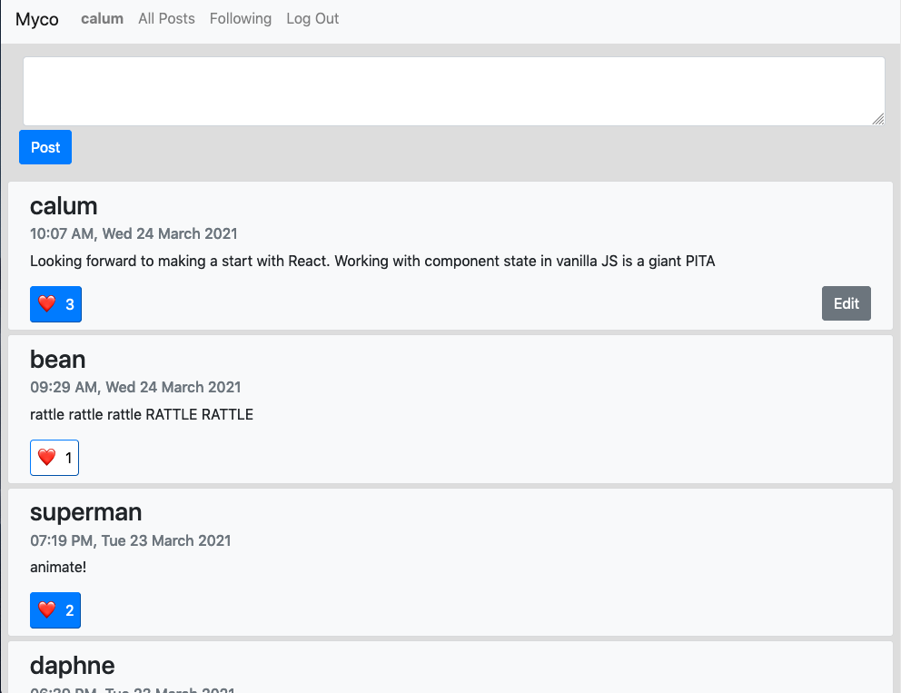

# Network
Project 4 of [CS50's Web Programming with Python and JavaScript](https://cs50.harvard.edu/web/2020/)

A Twitter-like social network website built using [Django](https://www.djangoproject.com/) and [Django REST Framework](https://www.django-rest-framework.org/). The name **Myco** was inspired by [mycorrhizal networks](https://www.merlinsheldrake.com/entangled-life).

[Full project specification](https://cs50.harvard.edu/web/2020/projects/4/network/)




# Setup

First, clone this repository:

```bash
git clone https://github.com/calumbell/cs50w-network
cd network
```

Install dependencies:

```bash
pip install -r requirements.txt
```
Django requires a secret key, so you will need to make sure that you add one to your *bash profile*.

```bash
SECRET_KEY="your-secret-key-goes-here"
export SECRET_KEY 
```

You can generate a random secret key by running:

```bash
python -c "import secrets; print(secrets.token_urlsafe())"
```


To run the development server:
```bash
python manage.py runserver
```

# Visuals
Click [here](https://youtu.be/ZxtYTCYYbdU) to see a video of this project in action.
